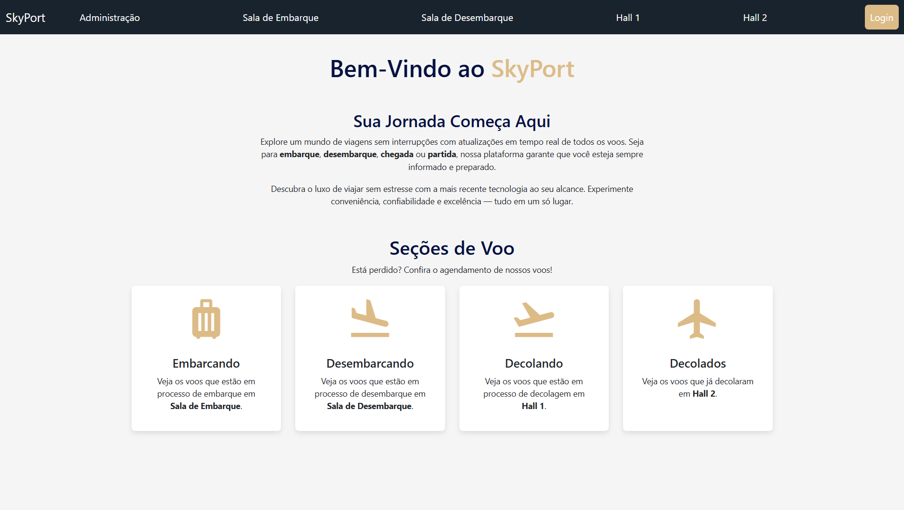
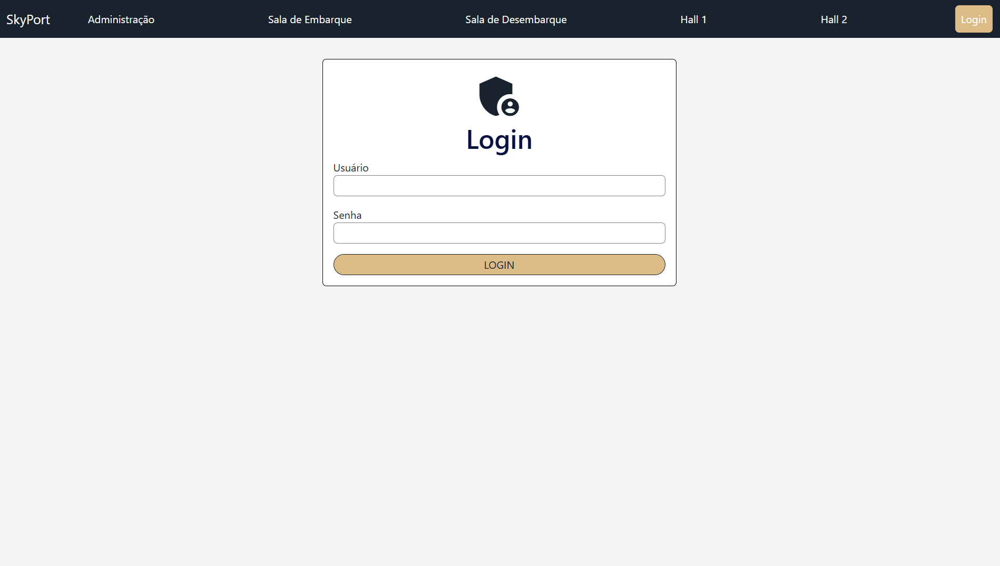
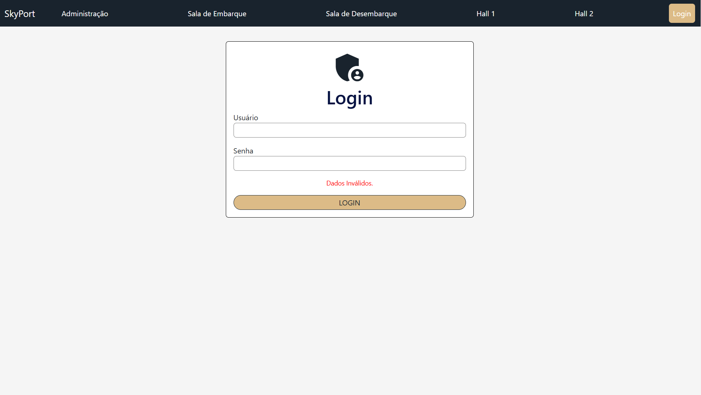
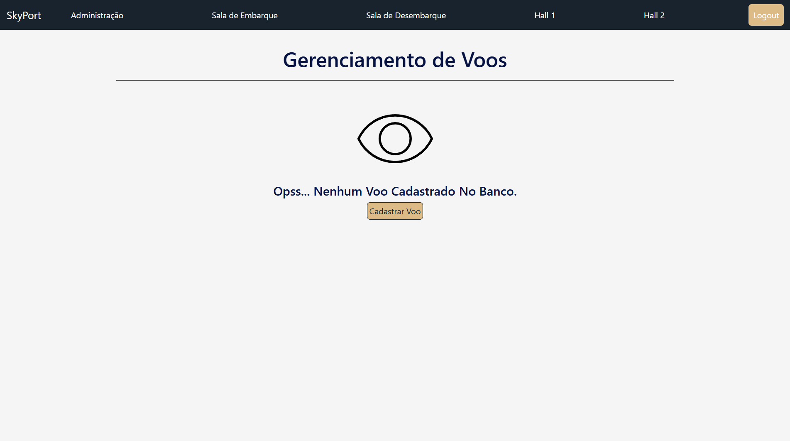
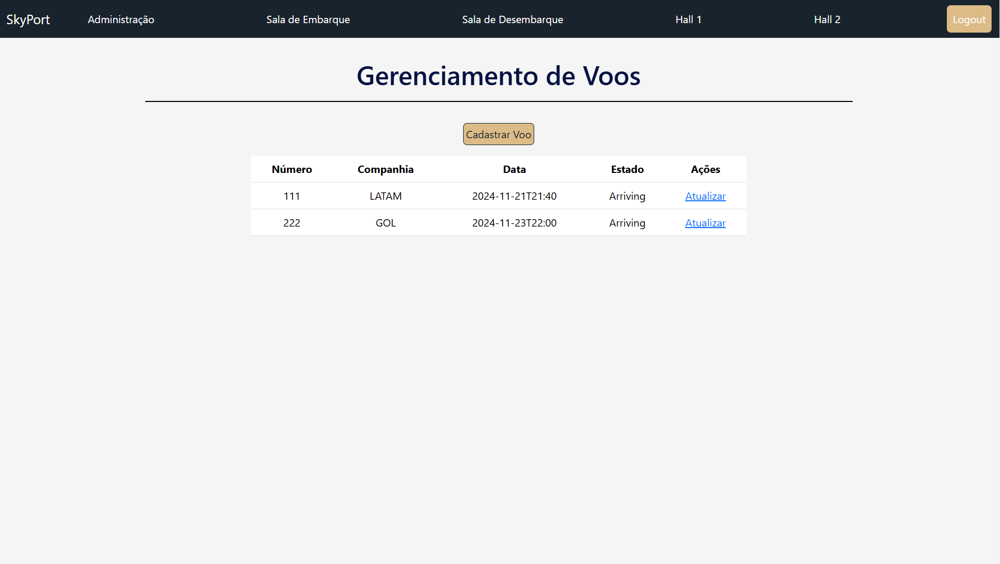
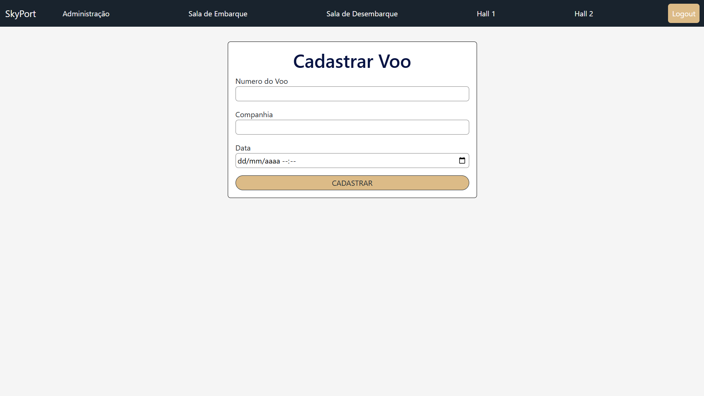
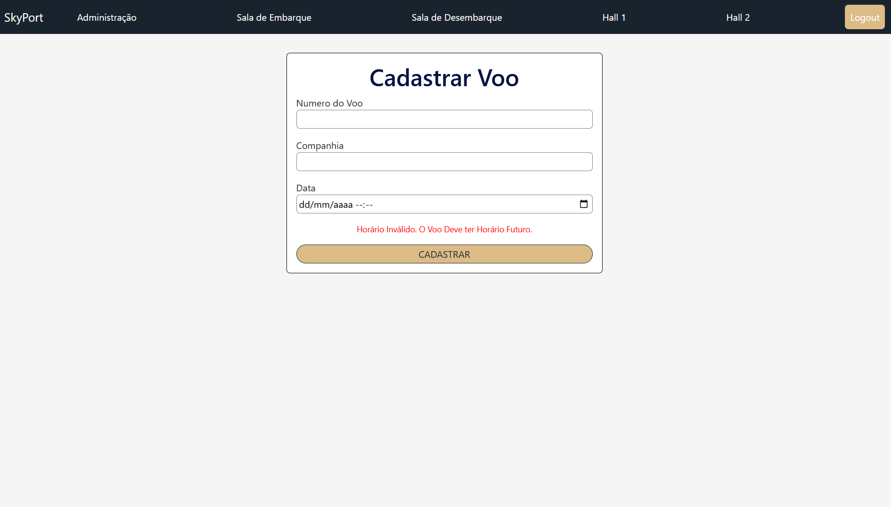
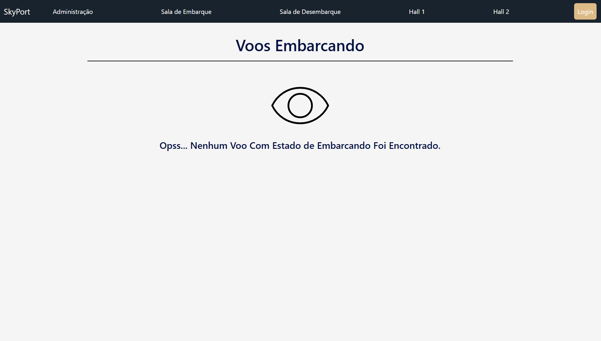
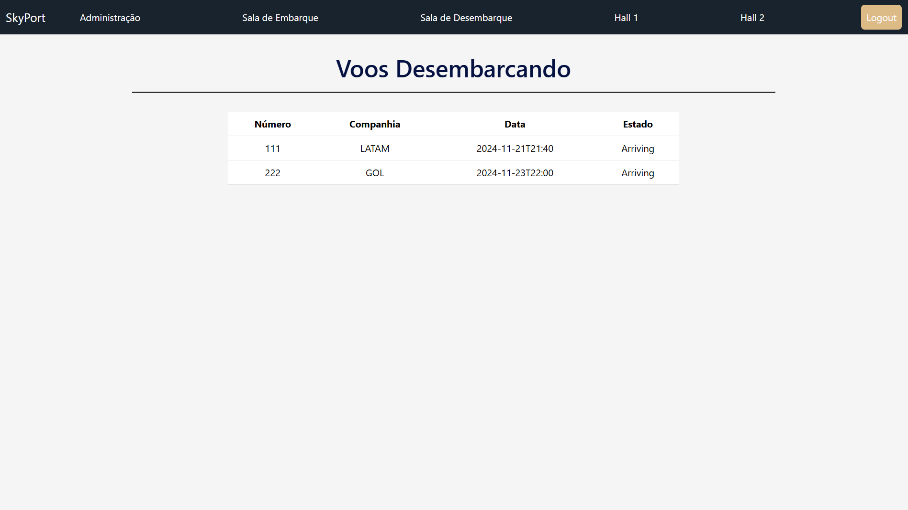
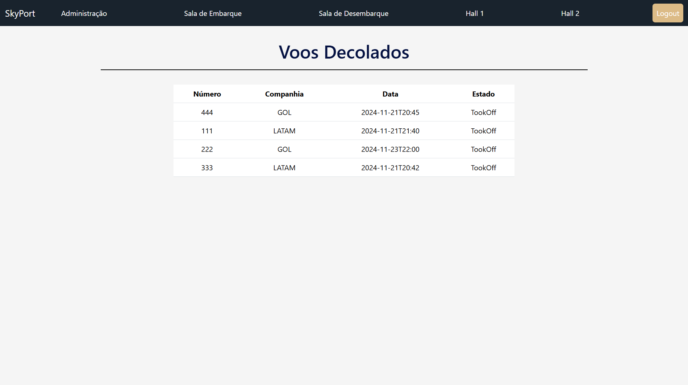

# ✈️ Sistema de Gerenciamento de Voos  

## 📖 Descrição  

Este projeto é uma aplicação web desenvolvida em **Java** para o gerenciamento de voos em um aeroporto. A aplicação permite:  
- Cadastro de novos voos;  
- Atualização do estado de cada voo;  
- Exibição de informações atualizadas para passageiros em **totens de informação**.  

Além disso, utiliza **padrões de projeto** como: **Observer**, **State**, **Front Controller** e **MVC**, garantindo escalabilidade e modularidade.  

---

## 💻 Tecnologias Utilizadas  

  
  
  
  
  
  

  

### **Java (Servlets)**  
- Implementa a lógica de negócios no backend, processando requisições HTTP e gerenciando o fluxo de dados entre o frontend e o banco de dados.  

### **JSP (JavaServer Pages)**  
- Criação de páginas dinâmicas que exibem informações sobre voos e estados.  

### **HTML/CSS**  
- Estruturação e estilização das páginas para uma interface intuitiva e amigável.  

### **Bootstrap**  
- Proporciona um design responsivo e compatível com diferentes dispositivos, como smartphones e tablets.  

---

## ⚙️ Funcionalidades  

### 1️⃣ **Gestão de Voos**  
- Cadastro de voos com número, companhia aérea e horário.  
- Atualização de estados: `chegando → embarcando → decolando → decolado`.  
- Remoção automática de voos ao atingir o estado "decolado".  

### 2️⃣ **Autenticação do Administrador**  
- Login seguro (usuário padrão: `admin/admin`).  
- Controle de sessão, redirecionamento após login e logout.  

### 3️⃣ **Totens de Informação**  
- Atualização automática com informações de voos.  
- Exibição por estado, como "chegando" e "decolando".  

---

## 🧩 Padrões de Projeto Utilizados  

### 🔔 **Observer**  
Notifica os totens sobre mudanças nos voos em tempo real.  

### 🌀 **State**  
Gerencia a transição dos estados dos voos, garantindo consistência.  

### 🎛 **Front Controller**  
Centraliza o controle das requisições, facilitando a manutenção.  

### 🏗 **MVC**  
- **Model**: Gerencia os dados e lógica de negócio.  
- **View**: Responsável pela interface com o usuário (JSP).  
- **Controller**: Processa as requisições e atualizações.

---

## 📸 Screenshots  

### Página Inicial  
- **Descrição:** A página inicial do sistema funciona como o ponto de entrada para a plataforma, apresentando seu objetivo principal: facilitar o gerenciamento e a consulta de voos em um ambiente aeroportuário. Nela, os usuários encontram informações sobre as funcionalidades oferecidas pelo sistema e têm acesso direto às principais seções.

  
  

  

---

### Página de Login 
- **Descrição:** O sistema apresenta um formulário de login exclusivo para os administradores, permitindo sua autenticação e acesso às funcionalidades de gerenciamento de voos. O formulário inclui validação de entrada, garantindo que os dados fornecidos sejam corretos. Caso as credenciais estejam incorretas, uma mensagem de erro clara é exibida ao usuário.

  
  
  

  

---

### Página de Administração  
- **Descrição:** O sistema conta com uma **página exclusiva para administradores**, acessível após a autenticação bem-sucedida. Essa página permite o gerenciamento completo dos voos cadastrados no sistema. Se não houver voos cadastrados no sistema, uma **mensagem informativa** é exibida ao administrador, indicando a ausência de registros. Caso contrário, uma **tabela com os detalhes dos voos cadastrados** é apresentada, permitindo uma consulta fácil e organizada.

  
  
  

  

---

### Formulário de Cadastro de Voos
- **Descrição:** O sistema apresenta um formulário de cadastro de voos exclusivo para os administradores, permitindo o registro de mais voos no sistema. O formulário inclui validação de entradas, garantindo que os dados fornecidos sejam corretos. Caso alguma informação esteja incorreta, uma mensagem de erro clara é exibida ao usuário.

  
  
  

  

---

### Totens de Informação  
- **Descrição:** O sistema exibe uma lista de voos filtrados por estado. Se não houver voos no estado selecionado, uma mensagem informativa é apresentada ao usuário. Caso contrário, é exibida uma tabela com os detalhes dos voos disponíveis, permitindo consulta fácil e organizada.

  
  
  
  

  

---

## 👨‍💻 Autor    

- **Cristiano Oliveira (AQ3022641)**  